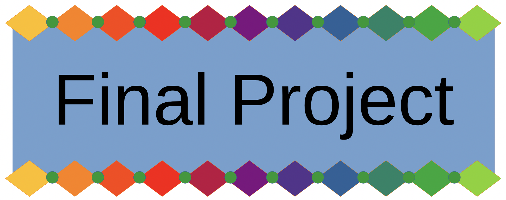

# Final Project: Python Application Development

CS101 Fall 2025: Final Project

🚀 This is your opportunity to showcase everything you've learned in CS101 by building a complete Python application that solves a real-world problem or fulfills a specific need. Building on the ideas you developed in Lab 08, you will now implement, test, document, and present your chosen project.

This project represents the culmination of your work this semester and demonstrates your mastery of Python programming concepts, problem-solving abilities, and software development practices.

## Assigned and Due

* **Assigned**: Thursday, 20th November 2025
* **Due**: Wednesday, 10th December 2025 at 9:00 AM
* **Presentation Date (Project Update)**: Wednesday, 4th December 2025 during class



## 🎯 Learning Objectives

By completing this final project, you will:

- Apply core Python programming concepts to solve real-world problems
- Design and implement a complete software application from scratch
- Write clear documentation for code and user instructions
- Test and debug a complex program
- Communicate technical ideas effectively through presentation
- Demonstrate mastery of Python fundamentals including data structures (use of primitives, lists, dictionaries), control flow, functions, modules, file I/O, addition to other concepts that we have covered throughout the course.

## 📚 Project Overview

### What You're Building

You will create a Python application based on one of the three ideas you proposed in Lab 08 (or a refined version approved by your instructor). Your application should be functional, well-documented, and demonstrate the programming skills you've developed throughout the semester.

### Working Individually or in Pairs

You can decide if you would like to work individually or with a partner. Consider the following guidelines:

- **Individual Projects**: Complete all components independently
- **Pair Projects**: Up to two partners. Both partners must contribute equally to all aspects (code, documentation, testing, and presentation). Group projects should demonstrate approximately 2x the complexity and features of individual projects.

## 📋 Project Requirements

Your final project must include **all five** of the following components:

### 1. 📖 Documentation

You will be creating documentation for your project using a `writing/README.md` file. This file is to contain sections in the documentation that includes:

- Section **Project Description**
  - Clear explanation of what your application does
  - The problem it solves or need it fulfills
  - Target users and use cases
  - If you have made a game, please describe the genre and gameplay: TODO
  
- Section **Setup and Installation Instructions**
  - How to set up the development environment using `uv`
  - List of all dependencies and how to install them with `uv`
  - Step-by-step instructions to get the application running using `uv run`
  
- Section **User Guide**
  - How to use the application
  - Description of features and functionality
  - Example usage scenarios
  
- Section **Technical Documentation**
  - Overview of code structure and organization
  - Explanation of key functions and modules
  - Design decisions and rationale

**Documentation should be written in clear, professional language in a README.md file in your project root.**

### 2. 💻 Code Implementation

Your Python code must demonstrate the following:

**Required Programming Concepts** (all must be included):

The following are concepts that we have covered in the course. Please incorporate each into your your project code.

- ✅ **Lists**: Use lists to store and manipulate collections of data
- ✅ **Dictionaries**: Use dictionaries for key-value data storage
- ✅ **Functions**: Implement multiple functions with clear purposes
- ✅ **Conditional Loops** (`while` loops): Use conditional iteration where appropriate
- ✅ **Range Loops** (`for` loops with `range()`): Use range-based iteration
- ✅ **File I/O**: Read from and/or write to files
- ✅ **Exception Handling**: Handle at least one type of error using `try-except`

**Code Quality Standards**:

- Follow Python naming conventions (snake_case for variables/functions)
- Use meaningful variable and function names
- Include docstrings for all functions
- Add inline comments to explain complex logic
- Organize code into logical sections or modules
- Keep functions focused on single tasks (good modularity)

**Best Practices**:

- No global variables (except constants)
- Proper indentation and formatting
- Use the "DRY" principle (An acronym for "Don't Repeat Yourself")
- Code should be clean and readable. You can use multiple files/modules if needed.

### 3. 🧪 Testing

Demonstrate that your application works correctly:

- **Test Cases**: Create and document a set of test cases that validate your application's functionality
- **User Testing**: Perform user-level testing to ensure the application works as intended
- **Edge Cases**: Test boundary conditions and handle edge cases appropriately
- **Error Testing**: Verify that exception handling works correctly

**Testing Documentation**: Complete the `writing/testing.md` file to document your testing process. This document should explain how you tested your application. Note: We are not using automated testing frameworks like pytest in this course. Focus on manual testing strategies—running your program with `uv run src/main.py` using different inputs, testing edge cases, and verifying your exception handling works as expected.

### 4. 🎤 Presentation

Deliver a **5-10 minute presentation** to the class that includes:

- **Project Introduction** (1-2 min)

  - What problem does it solve?
  - Who is it for?
  
- **Live Demonstration** (3-5 min)

  - Show your application in action
  - Demonstrate key features
  - Show it handling different inputs/scenarios
  
- **Technical Highlights** (2-3 min)

  - Interesting coding challenges you solved
  - Creative approaches you took
  - Technologies or techniques you learned

**Note**: Your project doesn't need to be 100% polished for the presentation, but it should be functional enough to demonstrate its core features effectively.

**Presentation Tips**:

- Practice your demo beforehand to make sure that the code runs smoothly
- Have a backup plan if something does not work
- Be prepared to answer questions

### 5. 📝 Reflection Document

Complete the `writing/reflection.md` file with thoughtful responses about:

- Technical Implementation
- Challenges and Solutions
- Learning and Growth
- Project Evolution

---

## 🎯 Assessment and Evaluation Criteria

Your project will be evaluated based on:

### Functionality (30%) (presented application, src/ directory)

- Able to verbally explain how to the code works
- Application works as intended
- Implements core features successfully
- Handles user input appropriately
- Error handling functions correctly

### Code Quality (25%) (src/ directory)

- Includes all required programming concepts
- Follows Python best practices
- Well-commented and documented
- Clean, organized, and readable

### Documentation (20%) (writing/README.md)

- Clear and comprehensive README
- Adequate setup instructions
- Good user guide
- Technical documentation present

### Testing (10%) (writing/testing.md)

- Adequate test coverage
- Edge cases considered
- Testing documented

### Presentation (10%) In class

- Clear communication
- Effective demonstration
- Appropriate length and content

### Reflection (5%) (writing/reflection.md)

- Thoughtful analysis
- Addresses all prompts
- Shows learning and growth

## 💡 Project Scope Guidelines

### Appropriate Scope

Your project should be:

- ✅ Completable within 2-3 weeks
- ✅ Challenging but achievable
- ✅ Demonstrative of multiple programming concepts
- ✅ Functional and testable

### Too Simple

Avoid projects that are:

- ❌ Just basic input/output
- ❌ Single-function programs
- ❌ Too similar to class exercises

### Too Complex

Avoid projects that require:

- ❌ Advanced libraries that you do not feel comfortable using
- ❌ Complex GUI frameworks (unless experienced)
- ❌ Machine learning or AI (unless specifically discussed)
- ❌ Web frameworks or databases (unless approved)

**When in doubt, consult with your instructor!**

### Running Your Program

You will have to have a main entry point for your application, typically `src/main.py`.

To run your Python program, use:

```bash
uv run src/main.py
```

### Installing Dependencies

To manage the dependencies of your project, you will need the file, `pyproject.toml` which can be created using `uv init pyproj`. Note, the file `README.md` is also crated here, but for this work, you will be modifying the one already provided; `writing/README.md`.

To add dependencies to your project, use the command:
```bash
uv add package-name
```


## 📤 Submission

### Code Submission
Commit and push your code regularly using Git:

```bash
git add -A
git commit -m "Descriptive message about your changes"
git push
```

**Important**: Verify your files appear correctly on GitHub after pushing!

### What to Submit
- All source code in the `src/` directory
- Completed `writing/README.md` documentation
- Completed `writing/reflection.md`
- Completed `writing/testing.md`
- Any data files or resources needed to run your application
- Test files or testing documentation

## 🎓 Academic Integrity

- Your code must be your own work (or your pair's work)
- You may use online resources for learning, but cite them in your reflection
- Do not copy code directly from tutorials or other students
- Using AI tools like ChatGPT is allowed for learning, but you must understand and be able to explain all code you submit
- Cite any external libraries or code snippets used

## Seeking Assistance

Students who have questions about this project outside of class time are invited to ask them in the course's Discord channel or during instructor's or TL's office hours.
